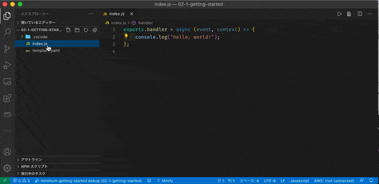

# Step 2 最小限入門

[Step 1 環境準備](./01-installation.md)で設定した環境が設定済みであることを前提に進めます。

## 実行

ターミナル(コマンドプロンプト, PowerShell, bash, zsh, etc.)を立ち上げ、以下コマンドを実行します。

```
% git clone git@github.com:intptr-t/aws-lambda-local-debug.git
% cd src/02-1-getting-started
% code .
```

Visual Studio Codeが立ち上がったら、`index.js` を開きブレークポイントをセットします。

次に Visual Studio Codeのターミナルを立ち上げます。
立ち上がったターミナルに以下を貼り付け実行します。

```
% sam local invoke "test" --template ./template.yaml --docker-network sam-local --no-event --debug-port 5858 --profile local-test
```

Visual Studio Codeのターミナルに以下の内容が出力されたら、デバッグ開始の準備完了です。
`F5`キーを入力し、デバッグ実行します。

```
Debugger listening on ws://0.0.0.0:5858/xxxxxxxx-xxxx-xxxx-xxxx-xxxxxxxxxxxx
For help, see: https://nodejs.org/en/docs/inspector
```

実行結果

```
2021-01-24T18:12:43.649Z	289a5fc1-f44e-4614-8efa-ea443bcfd0eb	INFO	hello, world!
END RequestId: 289a5fc1-f44e-4614-8efa-ea443bcfd0eb
REPORT RequestId: 289a5fc1-f44e-4614-8efa-ea443bcfd0eb	Init Duration: 0.82 ms	Duration: 6741.21 ms	Billed Duration: 6800 ms	Memory Size: 128 MB	Max Memory Used: 128 MB	
null
```



## コマンドの詳細 公式リファレンス
- [sam local invoke](https://docs.aws.amazon.com/ja_jp/serverless-application-model/latest/developerguide/sam-cli-command-reference-sam-local-invoke.html)
- [Step-through debugging Lambda functions locally](https://docs.aws.amazon.com/ja_jp/serverless-application-model/latest/developerguide/serverless-sam-cli-using-debugging.html)

Prev to [Step 1 環境準備](./01-installation.md)

Back to [README](../README.md)

Next To [Step 3 解説とカスタマイズ](./03-instruction-customize.md)
