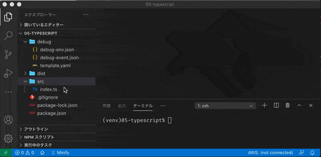

# Step 5 TypeScriptでデバッグ

本節では、TypeScript を使ってブレークポイント設定しながら、デバッグする方法を説明します。
なお、ここでは2021/01/25時点のCDK `aws-lambda-nodejs` で採用されている esbuild を使って TypeScript をバンドルします。

対象ディレクトリ: [05-typescript](../src/05-typescript)

## template.yaml を 編集

ここまでは、JavaScriptのindex.jsを直接実行していましたが、ここでは TypeScript で生成した index.js を実行することになります。
そのため、生成された index.js が実行されるよう、以下のように設定を変更します。

```yaml
      Metadata:
        aws:asset:path: "../dist"
```

## 開発環境向け パッケージインストール

```
npm install
```

## デバッグ用 パッケージインストール

デバッグ向けのディレクトリ `dist` npmパッケージを導入します。

- macOS/Linux

```
mkdir -p dist
cp package.json dist/package.json
npm --prefix ./dist install
rm dist/package.json
```

- Windows

```
mkdir -p dist
copy package.json dist/package.json
npm --prefix ./dist install
del dist/package.json
```

## esbuild を使ってトランスパイル -> バンドル

```
npx esbuild --bundle --target=es2019 --platform=node src/index.ts --sourcemap --external:aws-sdk --external:source-map-support --outdir=dist
```

## 実行

```
sam local invoke "test" --template ./debug/template.yaml --docker-network sam-local --event ./debug/debug-event.json --env-vars ./debug/debug-env.json --debug-port 5858 --profile local-test
```

## 実行結果

標準を介しての出力は、1行が長くなってしまうと潰れてしまっています(これは、TypeScriptに限った話ではありません)
どうしてもログとして出したい場合は、ファイルへ出力するオプション `--log-file` を使用する方が良いでしょう。
ただし、このオプションを使用すると標準出力/標準エラーへは出力されなくなります。

### 標準出力結果

```
2021-01-24T21:30:57.740Z        7f615505-423d-4ceb-ac0b-fbaadcb528bd       INFO    test48D3E1BA: {"EventParam":"foobar"}
2021-01-24T21:30:57.749Z        7f615505-423d-4ceb-ac0b-fbaadcb528b    at Runtime.handleOnce (/var/runtime/Runtime.js:66:25)
2021-01-24T21:31:03.558Z        7f615505-423d-4ceb-ac0b-fbaadcb528bd       INFO    Exit
{"statusCode":400}END RequestId: 7f615505-423d-4ceb-ac0b-fbaadcb528bd
REPORT RequestId: 7f615505-423d-4ceb-ac0b-fbaadcb528bd  Init Duration: 1.09 ms     Duration: 11490.32 ms   Billed Duration: 11500 ms Memory Size: 128 MB      Max Memory Used: 128 MB
```

### `--log-file` で出力されたログファイル

source-map-supportを使用しているため、スタックトレースでTypeScriptの行番号が取れていることがわかります。

```
START RequestId: 043f2442-2347-4348-ba4c-3263a2d885d1 Version: $LATEST
Debugger listening on ws://0.0.0.0:5858/cc194fbe-943e-4089-9d3f-5c6caaea5b31
For help, see: https://nodejs.org/en/docs/inspector
Debugger attached.
2021-01-24T21:39:54.759Z	043f2442-2347-4348-ba4c-3263a2d885d1	INFO	test48D3E1BA: {"EventParam":"foobar"}
2021-01-24T21:39:54.766Z	043f2442-2347-4348-ba4c-3263a2d885d1	ERROR	Error: hello,world
    at Runtime.handler (/var/src/index.ts:29:13)
    at Runtime.handleOnce (/var/runtime/Runtime.js:66:25)
2021-01-24T21:39:55.521Z	043f2442-2347-4348-ba4c-3263a2d885d1	INFO	Exit
{"statusCode":400}END RequestId: 043f2442-2347-4348-ba4c-3263a2d885d1
REPORT RequestId: 043f2442-2347-4348-ba4c-3263a2d885d1	Init Duration: 0.53 ms	Duration: 9392.76 ms	Billed Duration: 9400 ms	Memory Size: 128 MB	Max Memory Used: 128 MB	
```



## ⚠️注意

TypeScriptになるため、毎回ビルドを忘れないよう注意しましょう。。。

Prev to [Step 4 環境変数とイベント引数](./04-env-event.md)

Back to [README](../README.md)

Next to [Step 6 CDK + TypeScriptでデバッグ](./06-cdk-typescript.md)
