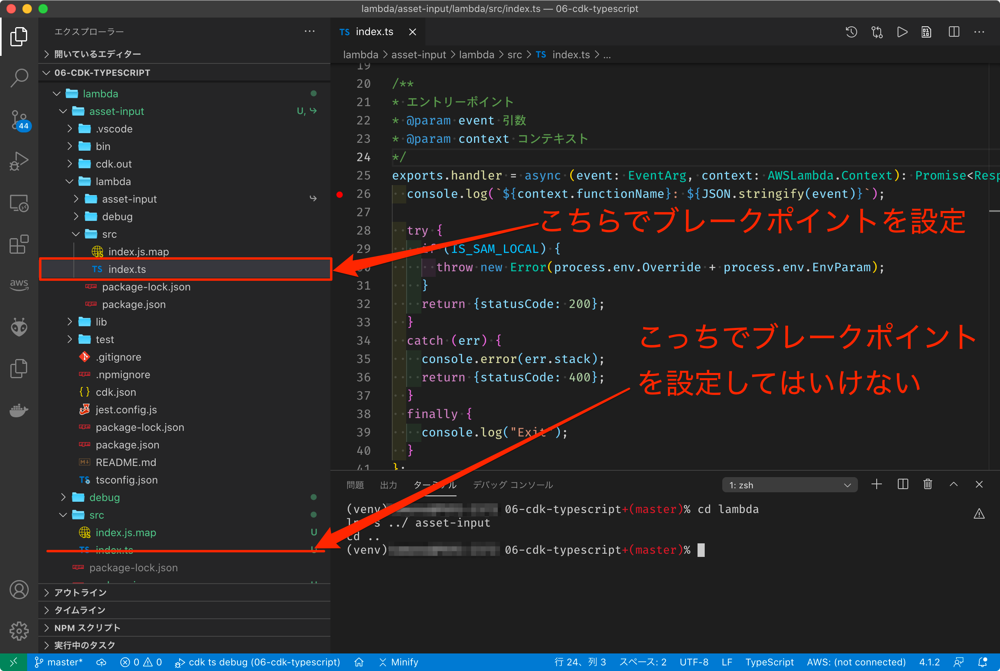

# Step 6 CDK + TypeScriptでデバッグ

対象ディレクトリ: [06-cdk-typescript](../src/06-cdk-typescript)

## lanuch.jsonを編集

sourcemapファイル(*.map)が出力されるディレクトリに `localRoot` を設定する必要があります。

```json
      "localRoot": "${workspaceRoot}/lambda/src",
```

## パターン1 Dockerイメージを使ってバンドルする

### スタックをビルド -> template.yamlを生成する

```
npm run build
npx cdk synth CdkTypescriptStack --no-staging > cdk.out/template.yaml
```

出力される sourcemap ファイルのパスは Dockerコンテナ内で構築しており、これが asset-input を要求します。
具体的には 「../asset-input/lambda/src/index.ts」 を指しており、これは index.js.map を基準に 対象の index.ts が見つかるようブレークポイントの貼り方に工夫が必要になる。
この方法ではシンボリックリンクを作成することで対応します。

まず、シンボリックリンクを作成します。

```
cd lambda
ln -s ../ asset-input
cd ..
```

ブレークポイントを `asset-input` を介したソースコードの位置でブレークポイントを設定します。


以下のコマンドで実行 -> `F5` キーでデバッグを開始します。

```
sam local invoke "cdkTypeScriptExample" --template ./cdk.out/template.yaml --docker-network sam-local --event ./lambda/debug/debug-event.json --env-vars ./lambda/debug/debug-env.json --debug-port 5858 --profile local-test
```

## パターン2 ローカルのesbuildを使ってバンドルする

出力される sourcemap ファイルのパスは cdk.out/asset.****を基準にしているため、相対パスで エントリーのソースコードパスを示すようになる。
具体的には 「../../lambda/src/index.ts」 を指しており、これは index.js.map を基準に 対象の index.ts が見つかるようブレークポイントの貼り方に工夫が必要になる。
このプロジェクトでは、src配下にindex.js.mapを出力することで階層を上がる数と同じになるように工夫している。

### バンドラーインストール
CDKのドキュメントの[Local bundling](https://docs.aws.amazon.com/cdk/api/latest/docs/aws-lambda-nodejs-readme.html#local-bundling)にしたがって、バンドラーを導入する。

```
npm install --save-dev esbuild@0
```

### スタックをビルド -> template.yamlを生成する (パターン1と同じ)

```
npm run build
npx cdk synth CdkTypescriptStack --no-staging > cdk.out/template.yaml
```

以下のコマンドで実行します。

```
sam local invoke "cdkTypeScriptExample" --template ./cdk.out/template.yaml --docker-network sam-local --event ./lambda/debug/debug-event.json --env-vars ./lambda/debug/debug-env.json --debug-port 5858 --profile local-test
```

ブレークポイントを index.ts の適当な位置に設定し、`F5`キーでデバッグを開始します。

## 初回構築時の注意点

- Lambdaで実行するTypeScriptのコードの格納場所に注意

CDK スタックのビルド時に誤ってビルド対象に含まれてしまいます。
`tsconfig.json` の `exclude` に対象のパスを追加してください。
本プロジェクトでは、 "lambda" ディレクトリを除外に追加しています。

Prev to [Step 5 TypeScriptでデバッグ](./05-typescript.md)

Back to [README](../README.md)
