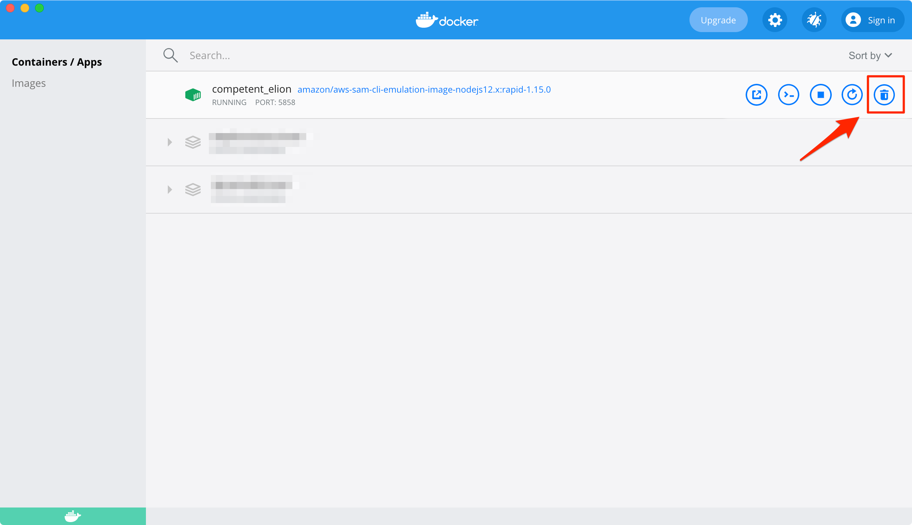

# トラブルシュート

## すでに起動済みのエラーが出る

`sam local invoke` を実行した時に、以下のようなエラーが出た場合、すでにコンテナが立ち上がっている状態のため再度実行ができなくなっています。
- Ctrl+C などで、invoke 実行を中断したが、コンテナが残り続けている
- デバッグ中に Visual Studio Code を閉じてしまった

```
docker.errors.APIError: 500 Server Error: Internal Server Error ("driver failed programming external connectivity on endpoint naughty_mestorf (fc4d870df8c20c73290a6f202046e8aee8cd2288c19609421f4886f2206919ff): Bind for 127.0.0.1:5858 failed: port is already allocated")
```

`docker ps` コマンドで実際すでに立ち上がっているかを確認することができます。

```
% docker ps
CONTAINER ID   IMAGE                                                        COMMAND                  CREATED          STATUS          PORTS                                                NAMES
ff2d0b5c3246   amazon/aws-sam-cli-emulation-image-nodejs12.x:rapid-1.15.0   "/var/rapid/aws-lamb…"   40 minutes ago   Up 40 minutes   127.0.0.1:5858->5858/tcp, 127.0.0.1:7065->8080/tcp   competent_elion
```

CONTAINER ID と NAMESを引数に `docker kill` + `docker rm` で停止+削除させることができます。

```
% docker kill ff2d0b5c3246
ff2d0b5c3246
% docker rm competent_elion
competent_elion
```

また、Docker Desktopのダッシュボードから削除する場合は、以下画像のゴミ箱アイコンを選択すれば停止+削除できます。


